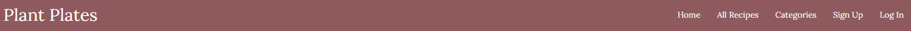
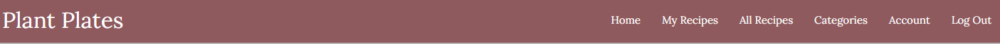

# Plant Plates

## Milestone Project 3 - Backend Development

(This is spacing for the main image once project is complete)

- The recipe website is aimed at age 12 onwards to enjoy to cook. The website should bring inspiration and enjoyment through cooking. It should also entice the visitor to prepare something that they did not intend. We want this to be a hub of activity and a place where users will store there recipes and allow other people to view them.
- This is my Milestone Project 3 submission for Code Institutes Diploma in Web Application Development Course. My website uses both relational and non-relational databases, features full CRUD functionality and is built using technologies that I have learnt including HTML, CSS, JavaScript, Python, Flask and PostgreSQL.

## Project Link

(Link to the project)

## Repository

(Link to repo)

## Project Goals

This website is dedicated for people who love food and want to share there love for food. This also has a heavy influence from myself and my girlfriend as this is a dream we've always wanted, a website where we can express our creativity with food for everyone to enjoy. There will be a lot of recipes from ourselves but also recipes from other people who have uploaded them. There are also articles about food which people can read and create themselves.

There is an account page which will be the hub for the return user so they can store all their recipes and have somewhere to go back to.

# Table of Contents

## Contents

1. User Stories
   - [First-time Users](#first-time-users)
   - [Returning Users](#returning-users)
   - [Website Owners](#website-owners)
2. [Design](#design)
   - [Typography](#typograhy)
   - [Images](#images)
   - [Colour Scheme](#color-scheme)
   - [Wireframes](#wireframes)

### First time Users

- As a first-time user, I want the website to be accessible on any device.
- As a first-time user, I want the website to be easy to navigate.
- As a first-time user, I want to sign-up quickly and easily.
- As a first-time user, I want find what recipe I want quickly and easily.

### Returning Users

- As a returning user, I want to be able to login easily on the homepage.
- As a returning user, I want to be able to create / read / edit / delete my own recipes.
- As a returning user, I want to be able to search for recipes with keyword criteria, as well as specific recipe criteria e.g. difficulty, cuisine, ingredients, how to cook.
- As a returning user, I want to see featured / trending recipes on the homepage.
- As a returning user, I want the website to be accessible on any device.
- As a returning user, I want the recipe layout to be in an organised list with an image referring to the dish.
- As a returning user, I would like to have access to social media links.
- As a returning user, I want the option to have an e-mail newsletter.
- As a returning user, I want to know more about the owners and their ethos.

### Website Owners

- As a website owner, I want to make the website homely and connected to it's returning users.
- As a website owner, I want to let all visitors know about the ethos behind the website.
- As a website owner, I want to be able to create /read / edit / delete cuisines and also give to
- As a website owner, I want the website to function on all devices and look appealing.

## Design

### Overview

We want the design to homely but modern with very sleek kitchen feel. This is a place for people who can cook and if they are on the site for long we want it to be aesthetically pleasing. The name of the website is "Plant Plates", we are vegan and this represents that. We've look at multiple popular websites to understand the design layout and how they use the space appropriately e.g. not too many images, easy to read writing.

### Colour

### Typography

The fonts which I have picked are Lora and Playfair Display. I will use Lora for main headings and buttons where as I'll use Playfair Display for paragraphing and longer pieces of text. Both of these fonts are different, easy to read and also quite elegant.

### Imagery

Since it is a recipe website, I'm going to keep most of the images centered around the food. Most images will be posted by the users through the creation of recipes. Articles can also have images which will be posted through the same way as recipes.

### Wireframes

#### Mobile Wireframe

#### Tablet Wireframe

#### Desktop Wireframe

# Features

## All Page Features

### Navigation Bar

- This is what the nav bar looks like before the user has logged in on a desktop.

- This is what the nav bar looks like before the user logs in on a mobile.

- This is what the user has once logged in.

### Footer

- The footer is present through the website and stays the same with the social media icons.

### Modal Messages

- User sees this when logged in for 2 seconds.

- User sees this when logging out for 2 seconds

## Home Page

### Hero Image

- This is situated right underneath the nav-bar with the title of the website within it and an indication of what the website is about.

### Website Values

- These are the values of the website.

### Recently Added

- These are the most recently added recipes to the website. Everyone can see these, the user doesn't have to be logged in. Maximum of 4 will be shown.

### Plant Plates Logo

- This is the parallex which utilises Materilezes JavaScript Parallex feature.

### The story behind the website

- This section is about the website owners and there aim through the website.

## Login Page

- This is the login page

## Sign Up

- This is the sign up pge which has a link to the login page incase the user already has an account.

## Account Page

- Once the user has logged in, they are transport to their account page.

## Create a New Recipe Page

