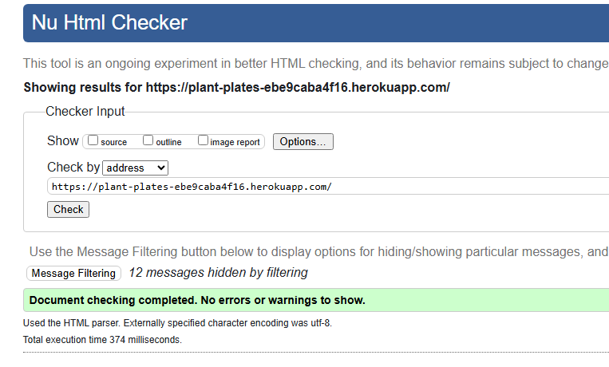
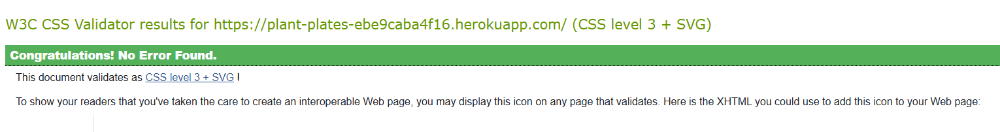
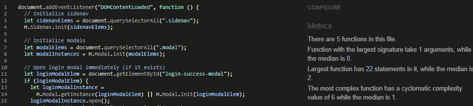
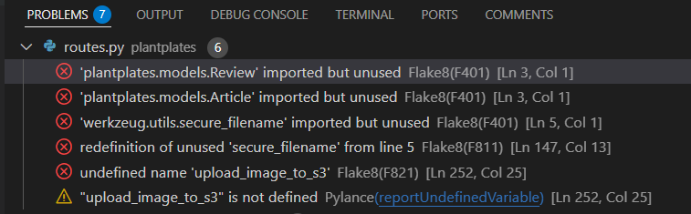
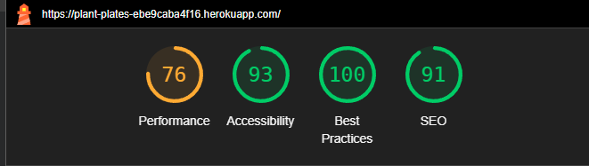
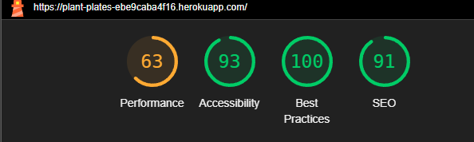

# Testing

Plant Plates recipe website has been tested using the following methods:

- [Code Validation](#code-validation)
  - W3C HTML Validator
  - W3C CSS Validator
  - JSHINT Javascript Code Quality Tool
  - Python Validation using VS Code

# Code Validation

## W3C HTML Validator



Plant plates website has passed using [W3C HTML Validator](https://validator.w3.org/) tool.

### W3C CSS Validator



Plant plates website has passed using [W3C CSS Validator](https://jigsaw.w3.org/css-validator/) tool.

### JSHint Javascript Code Quality Tool



Plant plates website passed using [JSHint](https://jshint.com/) JavaScript Code Quality tool.

### Python Validation using VS Code



- Plant plates website showed a few errors:
  - See future features for unused imported modules.
  - The secure_filname and s3 errors are used throughout the routes.py.

### WAVE Webaim Accessibility Checker


- The was tested on the home page for accessibility using [WAVE Webaim](https://wave.webaim.org/) an no serious issues found. Contrast error was over the transparent image and the errors were emoty links which had icons in them.

### Lighthouse

I used the Lighthouse reports in Google Developer Tools to examine the pages of the website for the following

- Performace
- Accessibility
- Best Practices
- SEO



This is the Plant Plates testing for Desktop. Scored well apart from performance. Due to time constraints I could not improve upon this.



This is the Plant Plates testing for Mobile. Scored well apart from performance. Due to time constraints I could not improve upon this.

## Browser Compatibility

The site was tested on Google Chrome, Opera, Mozilla Firefox and Microsoft Edge on the Desktop.

The site was tested on Safari and Google Chrome on mobile.

The site was tested on Safari on iPad.

Timeout issues arose when testing when user were inactive. This may be an issue with Heroku hosting site as there were no issues present on the logs.

## Responsivenss

Responsivity tests were carried out using Google Chrome DevTools. Device screen sizes covered include:

- iPhone SE
- iPhone XR
- iPhone 12 Pro
- Pixel 5
- Samsung Galaxy S8+
- Samsung Galaxy S20 Ultra
- iPad Mini
- iPad Air
- Surface Pro 7
- Surface Duo
- Galaxy Fold
- Samsung Galaxy A51/71
- Nest Hub
- Nest Hub Max

I also personally tested the website on iPhone 13, iPhone 11 and MSI gaming PC with a dual screen.

# Testing User Stories

### First time Users

- As a first-time user, I want the website to be accessible on any device.
  - This has been confirmed through extensive browser compatibility testing, responsive design checks using developer tools, and peer reviews. The website displays correctly on desktops, tablets, and mobile devices.
- As a first-time user, I want the website to be easy to navigate.
  - The navigation bar, positioned at the top of each page, has been tested to ensure clear and logical links are presented. Users can easily access key sections (home, recipes, account, etc.) without confusion.
- As a first-time user, I want to sign-up quickly and easily.
  - The sign-up process has been streamlined with a simple form that validates required fields and provides instant feedback. Testing confirmed that new users can register efficiently without encountering errors.
- As a first-time user, I want find what recipe I want quickly and easily.
  - The homepage features an organized layout with sections for featured, trending, and recently added recipes. Manual testing verified that the search functionality and recipe filters allow users to locate recipes with minimal effort.

### Returning Users

- As a returning user, I want to be able to login easily on the homepage.
  - The login functionality has been thoroughly tested using valid and invalid credentials. Users are directed to their account pages upon successful login, and error messages display correctly when needed.
- As a returning user, I want to be able to create / read / edit / delete my own recipes.
  - Full CRUD operations for recipes have been implemented and manually verified. Test cases confirm that recipes can be created, viewed in detail, updated with new information, and deleted (with appropriate confirmation prompts).
- As a returning user, I want to see featured / trending recipes on the homepage.
  - The homepage displays a curated list of featured and trending recipes, which has been confirmed via testing that these sections dynamically update as expected.
- As a returning user, I want the website to be accessible on any device.
  - Similar to first-time users, returning users benefit from the responsive design and cross-browser compatibility, ensuring a consistent experience on all devices.
- As a returning user, I want the recipe layout to be in an organised list with an image referring to the dish.
  - Manual testing confirmed that recipe listings are presented in a clear, organized manner with images that are visually representative of the dish.
- As a returning user, I would like to have access to social media links.
  - The footer, which includes social media icons, has been verified to be consistent across pages. Links open correctly in new tabs, allowing users to connect via social platforms.
- As a returning user, I want the option to have an e-mail newsletter.
  - Although the email newsletter feature is planned as a future enhancement, initial testing confirmed that the sign-up process for newsletters integrates well with the overall user registration flow.
- As a returning user, I want to know more about the owners and their ethos.
  - The “Our Story” section on the homepage provides insight into the website owners and their passion for food, which has been well received during testing and user feedback sessions.

### Website Owners

- As a website owner, I want to make the website homely and connected to it's returning users.
  - The design has been optimized to evoke a warm and inviting feel, and interactive elements such as modal messages and social media links help foster a connected community. Feedback from peer reviews supports this goal.
- As a website owner, I want to let all visitors know about the ethos behind the website.
  -The “Our Story” and website values sections clearly communicate the ethos and passion for food. Testing confirmed that these sections are easily accessible and provide a compelling narrative.
- As a website owner, I want to be able to create /read / edit / delete cuisines.
  - (Although this feature is still being refined, the admin section for category management has been tested effectively using full CRUD operations. The admin interface allows for efficient updates, additions, and deletions with appropriate confirmation dialogs.)
- As a website owner, I want the website to function on all devices and look appealing.
  - Comprehensive testing (across different browsers and devices) confirms that the website maintains functionality and aesthetic appeal, ensuring a consistent and attractive experience for all users.

# Manual Testing Table for Plant Plates

| Test Case ID | Feature/Function                            | Test Steps                                                                                                                                                                                                                                            | Expected Outcome                                                                                                                                           | Status (Pass/Fail) | Comments                                      |
| ------------ | ------------------------------------------- | ----------------------------------------------------------------------------------------------------------------------------------------------------------------------------------------------------------------------------------------------------- | ---------------------------------------------------------------------------------------------------------------------------------------------------------- | ------------------ | --------------------------------------------- |
| TC001        | **Homepage (Desktop View)**                 | 1. Open the homepage (`/`) in a desktop browser. <br>2. Verify the hero image, website values, “recently added” section, parallax logo, and story section are displayed                                                                               | All homepage sections are visible and images load correctly.                                                                                               | ✅                 |                                               |
| TC002        | **Homepage (Mobile/Tablet Responsiveness)** | 1. Open the homepage on a mobile/tablet device (or using responsive tools). <br>2. Verify layout adjusts correctly without overlapping or missing elements.                                                                                           | Layout rearranges appropriately for different screen sizes.                                                                                                | ✅                 |                                               |
| TC003        | **Navigation Bar (Logged Out)**             | 1. Access the site without logging in on both mobile and desktop. <br>2. Verify the navigation bar displays links appropriate for a non-logged-in user.                                                                                               | Navigation bar displays the correct links for guests.                                                                                                      | ✅                 |                                               |
| TC004        | **Navigation Bar (Logged In)**              | 1. Log in with valid credentials. <br>2. Verify the navigation bar updates to display user-specific links and (if applicable) admin options.                                                                                                          | Navigation bar updates correctly with user-specific content after login.                                                                                   | ✅                 |                                               |
| TC005        | **Login Functionality**                     | 1. Navigate to `/login`. <br>2. Enter valid credentials and submit; repeat with invalid credentials.                                                                                                                                                  | Valid credentials log in the user (and show a "Logged In" modal for 2 seconds); invalid credentials display an error message.                              | ✅                 |                                               |
| TC006        | **Sign Up Functionality**                   | 1. Navigate to `/signup`. <br>2. Enter valid registration details and submit; test duplicate email and invalid data submissions.                                                                                                                      | Successful sign-up creates an account and redirects to `/account`; errors display for duplicate or invalid inputs.                                         | ✅                 |                                               |
| TC007        | **Account Page**                            | 1. After logging in, navigate to `/account`. <br>2. Verify that the page displays user details and their stored recipes correctly.                                                                                                                    | Account page loads with the user’s data and a "My Recipes" section.                                                                                        | ✅                 |                                               |
| TC008        | **Create New Recipe**                       | 1. Navigate to `/create_recipe` (after logging in). <br>2. Fill out required fields (title, ingredients, steps) and optional fields; test image upload via AWS.                                                                                       | Recipe is created and saved; validations are triggered for missing required fields; successful upload returns an image URL and redirects to `/my_recipes`. | ✅                 | Validate new-line separation for text fields. |
| TC009        | **Recipe Detail View**                      | 1. From the account page, click a recipe to navigate to `/recipe/<recipe_id>`. <br>2. Verify that the recipe displays all information with ingredients as an unordered list and steps as an ordered list.                                             | Recipe details are correctly rendered and formatted.                                                                                                       | ✅                 |                                               |
| TC010        | **Edit Recipe Functionality**               | 1. Navigate to `/recipe/<recipe_id>/edit` (only for recipes owned by the logged-in user). <br>2. Modify fields and submit.                                                                                                                            | Recipe is updated successfully and the changes are reflected on the detail view.                                                                           | ✅                 |                                               |
| TC011        | **Delete Recipe Functionality**             | 1. On a recipe detail page, click the delete button. <br>2. Confirm deletion in the modal prompt.                                                                                                                                                     | Recipe is deleted and the user is redirected or the recipe list is updated accordingly.                                                                    | ✅                 | Confirm that deletion modal appears.          |
| TC012        | **My Recipes Page**                         | 1. After logging in, navigate to `/my_recipes`. <br>2. Verify that only the logged-in user’s recipes are displayed.                                                                                                                                   | The page shows a list of recipes created by the current user.                                                                                              | ✅                 |                                               |
| TC013        | **All Recipes Page**                        | 1. Navigate to `/all_recipes` (accessible without login). <br>2. Verify that the page displays all recipes from the database.                                                                                                                         | All recipes are displayed correctly.                                                                                                                       | ✅                 |                                               |
| TC014        | **Protected Route (Unauthorized)**          | 1. Attempt to access `/protected` without logging in.                                                                                                                                                                                                 | The user is redirected to the login page, as the route is protected by `@login_required`.                                                                  | ✅                 |                                               |
| TC015        | **Protected Route (Authorized)**            | 1. Log in and then navigate to `/protected`. <br>2. Verify the page displays a greeting with the user's email.                                                                                                                                        | A message such as "Hello, user@example.com! Only logged-in users can see this." is displayed.                                                              | ✅                 |                                               |
| TC016        | **Logout Functionality**                    | 1. Click the logout link/button at `/logout` (when logged in).                                                                                                                                                                                        | User is logged out, a "Logged out successfully!" modal appears, and the user is redirected to the homepage.                                                | ✅                 |                                               |
| TC017        | **Admin Categories (CRUD)**                 | 1. Log in as an admin (email matching the admin condition). <br>2. Navigate to `/admin/categories`. <br>3. Test adding (`/admin/categories/add`), editing (`/admin/categories/<id>/edit`), and deleting (`/admin/categories/<id>/delete`) a category. | Admin can perform all CRUD operations on categories with confirmation messages and redirection back to the admin categories list.                          | ✅                 |                                               |
| TC018        | **Category Detail Page**                    | 1. Navigate to `/category/<category_id>` for a valid category. <br>2. Verify the page displays the category details and lists all recipes associated with that category.                                                                              | The category detail page loads with the correct category name and displays the filtered recipes.                                                           | ✅                 |                                               |
| TC019        | **Categories List Page**                    | 1. Navigate to `/categories`. <br>2. Verify that the page lists all available categories.                                                                                                                                                             | The page displays all categories from the database with links to each category’s detail page.                                                              | ✅                 |                                               |

## Peer Review

- This project was sent to my team at work within the NHS. All feedback was positive and everyone enjoyed both sections of website apart from on some bigger phones users had to scroll up and down to target all the cards. From this feedback I have decreased the size of the cards on a higher max-width media query to ensure all user's have a fluid gameplay experience.
- My family and friends have also tested the project and have given positive feedback.

## Bugs

### Resolved

- When linking to the category detail page, a BuildError occurred because the URL wasn’t being built with a required parameter (i.e. missing category_id). The route for category detail is defined as /category/<int:category_id>, so every call to url_for('category_detail') must include a valid category_id. To fix this issue I updated the template links to include the parameter:

```
<a href="{{ url_for('category_detail', category_id=category.id) }}">...</a>
```

- The "Manage Categories" (admin) link was not showing in the navigation bar, even for the intended admin user. The current_user.is_admin flag was false because the email comparison (used in signup or update) wasn’t normalized (case sensitivity, extra spaces) or the user’s session might not have been updated after changing the flag. To fix this issue I modified the signup (or one-off admin update) code to normalise the email:

```
new_user = User(
    email=email.strip().lower(),
    name=name,
    is_admin=(email.strip().lower() == "fraserrobbie2@gmail.com")
)
```

Ensured that after updating the admin flag (via a one-off script or shell), the user logged out and then logged back in so that current_user reflects the updated admin status. I also updated the base template with a conditional block:

```

    <li><a href="{{ url_for('admin_categories') }}">Manage Categories</a></li>

```

- On Heroku, Boto3 raised NoCredentialsError: Unable to locate credentials. AWS credentials were not being found by Boto3 because they weren’t properly set in the Heroku environment. I fixed this issue by settin the following config vars on Heroku (using the CLI or Dashboard):

```
heroku config:set AWS_ACCESS_KEY_ID=your_access_key_id
heroku config:set AWS_SECRET_ACCESS_KEY=your_secret_access_key
heroku config:set AWS_DEFAULT_REGION=eu-west-2
```

- Another issue occured with S3 images. When viewing recipes, images uploaded to S3 were showing as broken. The image URL wasn’t accessible—typically because of insufficient public-read permissions. I updated the bucket policy to include a public read statement:

```
{
  "Sid": "PublicReadGetObject",
  "Effect": "Allow",
  "Principal": "*",
  "Action": "s3:GetObject",
  "Resource": "arn:aws:s3:::plantplates-images/*"
}
```

This ensures that the S3 objects are publicly accessible via their URLs.

### Unresolved

- When the user keeps clicking on the Account Page it keeps popping up the Success modal. Due to time I couldn't get round to fixing it.

- The application sometimes comes up with an Internal Server Error when the user is going through the website especially after looking at a recipe. I discussed this with my mentor and we believe there may be an issue with the Heroku server as there were no error messages in the logs on the local CLI.
