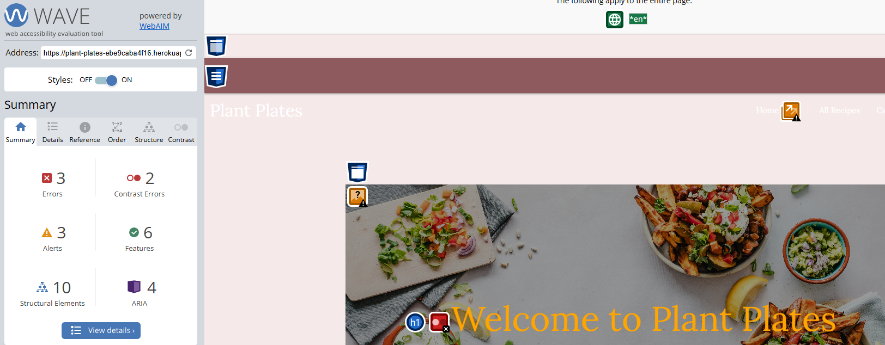

# Testing

Plant Plates recipe website has been tested using the following methods:

- [Code Validation](#code-validation)
  - W3C HTML Validator
  - W3C CSS Validator
  - JSHINT Javascript Code Quality Tool
  - Python Validation using VS Code

# Code Validation

## W3C HTML Validator

Plant plates website has passed using [W3C HTML Validator](https://validator.w3.org/) tool.

### W3C CSS Validator

Plant plates website has passed using [W3C CSS Validator](https://jigsaw.w3.org/css-validator/) tool.

### JSHint Javascript Code Quality Tool

Plant plates website passed using [JSHint](https://jshint.com/) JavaScript Code Quality tool.

### Python Validation using VS Code

- Plant plates website showed a few errors:
  - See future features for unused imported modules.
  - The secure_filname and s3 errors are used throughout the routes.py.

### WAVE Webaim Accessibility Checker

- The was tested on the home page for accessibility using [WAVE Webaim](https://wave.webaim.org/) an no serious issues found. Contrast error was over the transparent image and the errors were emoty links which had icons in them.

### Lighthouse

I used the Lighthouse reports in Google Developer Tools to examine the pages of the website for the following

- Performace
- Accessibility
- Best Practices
- SEO

This is the Plant Plates testing for Desktop. Scored well apart from performance. Due to time constraints I could not improve upon this.

This is the Plant Plates testing for Mobile. Scored well apart from performance. Due to time constraints I could not improve upon this.

## Browser Compatibility

The site was tested on Google Chrome, Opera, Mozilla Firefox and Microsoft Edge on the Desktop.

The site was tested on Safari and Google Chrome on mobile.

The site was tested on Safari on iPad.

Timeout issues arose when testing when user were inactive. This may be an issue with Heroku hosting site as there were no issues present on the logs.

## Responsivenss

Responsivity tests were carried out using Google Chrome DevTools. Device screen sizes covered include:

- iPhone SE
- iPhone XR
- iPhone 12 Pro
- Pixel 5
- Samsung Galaxy S8+
- Samsung Galaxy S20 Ultra
- iPad Mini
- iPad Air
- Surface Pro 7
- Surface Duo
- Galaxy Fold
- Samsung Galaxy A51/71
- Nest Hub
- Nest Hub Max

I also personally tested the website on iPhone 13, iPhone 11 and MSI gaming PC with a dual screen.

# Testing User Stories

# Manual Testing Table for Plant Plates

| Test Case ID | Feature/Function                            | Test Steps                                                                                                                                                                                                                                            | Expected Outcome                                                                                                                                           | Status (Pass/Fail) | Comments                                      |
| ------------ | ------------------------------------------- | ----------------------------------------------------------------------------------------------------------------------------------------------------------------------------------------------------------------------------------------------------- | ---------------------------------------------------------------------------------------------------------------------------------------------------------- | ------------------ | --------------------------------------------- |
| TC001        | **Homepage (Desktop View)**                 | 1. Open the homepage (`/`) in a desktop browser.  2. Verify the hero image, website values, “recently added” section, parallax logo, and story section are displayed                                                                               | All homepage sections are visible and images load correctly.                                                                                               | ✅                 |                                               |
| TC002        | **Homepage (Mobile/Tablet Responsiveness)** | 1. Open the homepage on a mobile/tablet device (or using responsive tools).  2. Verify layout adjusts correctly without overlapping or missing elements.                                                                                           | Layout rearranges appropriately for different screen sizes.                                                                                                | ✅                 |                                               |
| TC003        | **Navigation Bar (Logged Out)**             | 1. Access the site without logging in on both mobile and desktop.  2. Verify the navigation bar displays links appropriate for a non-logged-in user.                                                                                               | Navigation bar displays the correct links for guests.                                                                                                      | ✅                 |                                               |
| TC004        | **Navigation Bar (Logged In)**              | 1. Log in with valid credentials.  2. Verify the navigation bar updates to display user-specific links and (if applicable) admin options.                                                                                                          | Navigation bar updates correctly with user-specific content after login.                                                                                   | ✅                 |                                               |
| TC005        | **Login Functionality**                     | 1. Navigate to `/login`.  2. Enter valid credentials and submit; repeat with invalid credentials.                                                                                                                                                  | Valid credentials log in the user (and show a "Logged In" modal for 2 seconds); invalid credentials display an error message.                              | ✅                 |                                               |
| TC006        | **Sign Up Functionality**                   | 1. Navigate to `/signup`.  2. Enter valid registration details and submit; test duplicate email and invalid data submissions.                                                                                                                      | Successful sign-up creates an account and redirects to `/account`; errors display for duplicate or invalid inputs.                                         | ✅                 |                                               |
| TC007        | **Account Page**                            | 1. After logging in, navigate to `/account`.  2. Verify that the page displays user details and their stored recipes correctly.                                                                                                                    | Account page loads with the user’s data and a "My Recipes" section.                                                                                        | ✅                 |                                               |
| TC008        | **Create New Recipe**                       | 1. Navigate to `/create_recipe` (after logging in).  2. Fill out required fields (title, ingredients, steps) and optional fields; test image upload via AWS.                                                                                       | Recipe is created and saved; validations are triggered for missing required fields; successful upload returns an image URL and redirects to `/my_recipes`. | ✅                 | Validate new-line separation for text fields. |
| TC009        | **Recipe Detail View**                      | 1. From the account page, click a recipe to navigate to `/recipe/<recipe_id>`.  2. Verify that the recipe displays all information with ingredients as an unordered list and steps as an ordered list.                                             | Recipe details are correctly rendered and formatted.                                                                                                       | ✅                 |                                               |
| TC010        | **Edit Recipe Functionality**               | 1. Navigate to `/recipe/<recipe_id>/edit` (only for recipes owned by the logged-in user).  2. Modify fields and submit.                                                                                                                            | Recipe is updated successfully and the changes are reflected on the detail view.                                                                           | ✅                 |                                               |
| TC011        | **Delete Recipe Functionality**             | 1. On a recipe detail page, click the delete button.  2. Confirm deletion in the modal prompt.                                                                                                                                                     | Recipe is deleted and the user is redirected or the recipe list is updated accordingly.                                                                    | ✅                 | Confirm that deletion modal appears.          |
| TC012        | **My Recipes Page**                         | 1. After logging in, navigate to `/my_recipes`.  2. Verify that only the logged-in user’s recipes are displayed.                                                                                                                                   | The page shows a list of recipes created by the current user.                                                                                              | ✅                 |                                               |
| TC013        | **All Recipes Page**                        | 1. Navigate to `/all_recipes` (accessible without login).  2. Verify that the page displays all recipes from the database.                                                                                                                         | All recipes are displayed correctly.                                                                                                                       | ✅                 |                                               |
| TC014        | **Protected Route (Unauthorized)**          | 1. Attempt to access `/protected` without logging in.                                                                                                                                                                                                 | The user is redirected to the login page, as the route is protected by `@login_required`.                                                                  | ✅                 |                                               |
| TC015        | **Protected Route (Authorized)**            | 1. Log in and then navigate to `/protected`.  2. Verify the page displays a greeting with the user's email.                                                                                                                                        | A message such as "Hello, user@example.com! Only logged-in users can see this." is displayed.                                                              | ✅                 |                                               |
| TC016        | **Logout Functionality**                    | 1. Click the logout link/button at `/logout` (when logged in).                                                                                                                                                                                        | User is logged out, a "Logged out successfully!" modal appears, and the user is redirected to the homepage.                                                | ✅                 |                                               |
| TC017        | **Admin Categories (CRUD)**                 | 1. Log in as an admin (email matching the admin condition).  2. Navigate to `/admin/categories`.  3. Test adding (`/admin/categories/add`), editing (`/admin/categories/<id>/edit`), and deleting (`/admin/categories/<id>/delete`) a category. | Admin can perform all CRUD operations on categories with confirmation messages and redirection back to the admin categories list.                          | ✅                 |                                               |
| TC018        | **Category Detail Page**                    | 1. Navigate to `/category/<category_id>` for a valid category.  2. Verify the page displays the category details and lists all recipes associated with that category.                                                                              | The category detail page loads with the correct category name and displays the filtered recipes.                                                           | ✅                 |                                               |
| TC019        | **Categories List Page**                    | 1. Navigate to `/categories`.  2. Verify that the page lists all available categories.                                                                                                                                                             | The page displays all categories from the database with links to each category’s detail page.                                                              | ✅                 |                                               |

## Peer Review

- This project was sent to my team at work within the NHS. All feedback was positive and everyone enjoyed both sections of website apart from on some bigger phones users had to scroll up and down to target all the cards. From this feedback I have decreased the size of the cards on a higher max-width media query to ensure all user's have a fluid gameplay experience.
- My family and friends have also tested the project and have given positive feedback.
